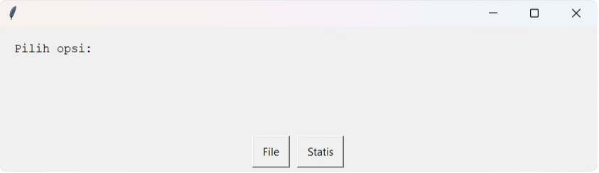
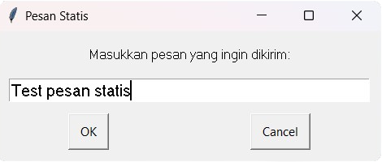
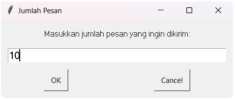

## Panduan Penggunaan Script AutoGuiBot

### Deskripsi
Script `index.py` digunakan untuk mengirim pesan secara otomatis menggunakan modul `pyautogui`. Panduan penggunaan berikut akan menjelaskan langkah-langkah untuk menggunakan script ini.

### Langkah-langkah

1. **Instalasi Dependensi**
    - Pastikan Anda telah menginstal modul `pyautogui` dan `easygui`.
    - Jika belum, instal modul tersebut menggunakan perintah:
        ```
        pip install pyautogui
        pip install easygui
        ```

2. **Menjalankan Script**
    - Buka terminal atau command prompt.
    - Gunakan perintah `python index.py` untuk menjalankan script.

3. **Memilih Opsi**
    - Setelah menjalankan script, akan muncul sebuah GUI dengan pilihan antara "File" atau "Statis" seperti gambar berikut :
    
    

   4. **Menggunakan Opsi "File"**
       - Jika memilih opsi "File", script akan membuka File Explorer.
       - Pilih file dengan format `.txt` yang berisi pesan-pesan yang ingin dikirim dengan contoh data seperti berikut :
       - ``` 
         test 1
         test 2
         test 3
         test 4
         test 5
         ```
         > **Peringatan:** Program akan mengeksekusi data per baris yang dienter!
       - Pastikan untuk membiarkan kursor Anda aktif di kolom input chat yang dituju.
       - Klik "OK" dan script akan mengeksekusi pesan-pesan dalam file secara berurutan.

5. **Menggunakan Opsi "Statis"**
    - Jika memilih opsi "Statis", Anda diminta untuk memasukkan pesan yang ingin dikirim seperti gambar berikut :
    
    
    
    - Selanjutnya, masukkan jumlah pesan yang ingin dikirim seperti gambar berikut :
    
    
    
    - Pastikan untuk membiarkan kursor Anda aktif di kolom input chat yang dituju.
    - Klik "OK" dan script akan mengeksekusi pesan yang telah diinputkan sebelumnya sebanyak yang diminta.

6. **Catatan Penting**
    - Pastikan untuk membiarkan kursor Anda aktif di kolom input chat yang dituju sebelum menekan "OK" pada GUI.
    - Untuk opsi "File", pastikan file `.txt` yang dipilih berisi pesan-pesan yang akan dikirimkan per baris.

### Gambaran Script
Script `index.py` mengimport modul `pyautogui`, `time`, dan `easygui`, dan mendefinisikan kelas `AutoGuiBot` serta fungsi-fungsi untuk menjalankan bot dan mendapatkan pesan dari file teks. Fungsi utama `main()` menampilkan GUI untuk memilih opsi "File" atau "Statis", dan sesuai dengan pilihan pengguna, mengambil pesan dari file atau dari input pengguna. Setelah itu, bot akan dijalankan untuk mengirimkan pesan-pesan tersebut secara otomatis.

Dengan mengikuti langkah-langkah di atas, Anda dapat menggunakan script ini untuk mengirim pesan secara otomatis melalui GUI yang disediakan.